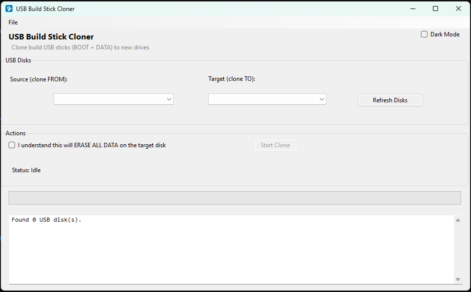

# USB Build Stick Cloner

A Windows utility for quickly cloning USB build and deployment sticks using a simple graphical interface.

Rather than performing a raw sector-by-sector clone, USB Build Stick Cloner recreates the target drive's partition layout and copies the files across. This allows deployment USB drives to be replicated while making use of the available capacity on the target drive.

## Screenshot

## Features

- Automatically detects connected USB drives
- Select separate source and target USB disks
- Displays USB disk model and capacity
- Safety confirmation before cloning
- Prevents the same disk being selected as both source and target
- Checks that the target disk is large enough
- Supports FAT32 + NTFS deployment USB layouts
- Supports single-partition USB layouts
- Automatically creates and formats target partitions
- File-level cloning using Robocopy
- Progress indicator and live operation log
- Light and dark modes
- Confirmation before destructive operations

## How It Works

For a typical deployment USB containing a FAT32 **BOOT** partition and an NTFS **DATA** partition, the application:

1. Detects the source partition layout.
2. Cleans and prepares the selected target USB.
3. Creates a FAT32 BOOT partition.
4. Creates an NTFS DATA partition using the remaining capacity.
5. Copies the BOOT and DATA files to their respective partitions.
6. Displays progress and operation information in the application log.

Single-partition FAT32 and NTFS USB drives are also supported.

## Built With

- C#
- Windows Forms
- .NET
- Windows Management Instrumentation (WMI)
- DiskPart
- Robocopy
- Visual Studio

## Running the Project

Open:

`UsbClonerGUI.slnx`

in Visual Studio and run the project.

> **Warning:** Cloning will erase the contents of the selected target USB drive. Always verify that the correct target disk has been selected before starting.

## Version

Version 1.0.0

## Author

Michael Day

## Status

Personal development project.
